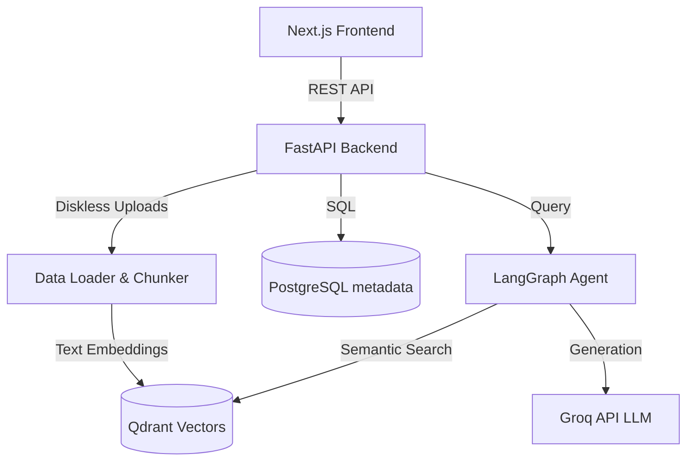

# NeuraDesk Architecture & Documentation

This document provides a comprehensive technical overview of the NeuraDesk (Python-RAG) architecture, component interactions, and data flow.

## 1. System Architecture Overview

NeuraDesk is structured as a decoupled client-server architecture:
- **Client**: Next.js single-page application (SPA).
- **API Gateway**: FastAPI server handling REST requests.
- **AI/RAG Engine**: LangGraph and Groq-powered synthesis engine.
- **Storage Layer**: PostgreSQL for structured metadata and Qdrant for vector embeddings.

## 2. Component Deep-Dive

### 2.1 Frontend (Next.js & TailwindCSS)
The frontend is built using Next.js (app router) in a Single Page Application style using a central `page.tsx` that manages state between 4 tabs:
- **ChatTab**: Interacts with `/api/chat` using stateful sessions. Features an animated glassmorphic UI.
- **UploadTab**: Interacts with `/api/upload`. Supports drag-and-drop.
- **ManageTab**: Interacts with `/api/documents` (GET and DELETE) to view and remove indexed documents.
- **SearchTab**: Interacts with `/api/search` allowing users to query specific document subsets and receive AI-synthesized answers over raw contexts.

**Styling**: Utilizes standard TailwindCSS integrated with CSS variables for custom animations (`fade-in-up`, `blob`) and a custom `glass-panel` utility for frosted transparency.

### 2.2 Backend (FastAPI)
The backend `api.py` acts as the main controller. It uses standard Pydantic models for request/response validation and injects database connections using async contexts.
- **CORS**: Configured to accept traffic from `http://localhost:3000`.
- **Statelessness**: The backend maintains no disk state. All uploaded files are stored temporarily via Python's `NamedTemporaryFile` and deleted inside `finally` blocks after processing.

### 2.3 Data Ingestion Pipeline (`src/data_loader.py` & `src/embedding.py`)
When a file is uploaded:
1. **Extraction**: The file extension dictates the `langchain_community` loader (e.g., `PyPDFLoader`, `Docx2txtLoader`, `CSVLoader`).
2. **Chunking**: The extracted documents are fed into a `RecursiveCharacterTextSplitter`.
3. **Metadata Enrichment**: Each chunk is annotated with `source`, `page`, and custom metadata tracking its origin file.

### 2.4 Vector Database (`src/vectorstore.py`)
NeuraDesk uses **Qdrant** for vector storage.
- **Embeddings**: Employs `sentence-transformers/all-MiniLM-L6-v2` locally to map text chunks to 384-dimensional vectors.
- **Payload Management**: Qdrant stores the raw text and source metadata in the vector payload.
- **Search capabilities**: Uses `client.query_points` (Qdrant 1.18.0 API) for highly efficient cosine similarity lookups. Also supports precise `source` filtering to scope down searches to specific files.
- **Deletion**: When a document is deleted via the API, the vector store executes a filter deletion (`delete_by_source`) to scrub all associated vector chunks immediately.

### 2.5 Relational Database (`src/db.py`)
**PostgreSQL** is used purely for lightweight metadata tracking.
- Maintains a `documents` table detailing `id`, `filename`, `document_type`, `size`, and `upload_date`.
- This ensures the UI has a fast, source-of-truth list of what is currently ingested without querying the heavier vector store.

### 2.6 LLM Orchestration (`src/search.py`)
Uses **LangGraph** to build a reliable conversational agent state machine.
- **State Definition**: Tracks `messages` and `context` across agent nodes.
- **Nodes**:
  - `retrieve`: Calls the vector store to fetch relevant chunks based on the user's latest message.
  - `generate`: Combines the retrieved context with the user's prompt and sends it to the Groq LLM API.
- **Edge Routing**: A straightforward `START -> retrieve -> generate -> END` pipeline.
- The default LLM is `llama-3.3-70b-versatile`, chosen for high-speed inference and reasoning accuracy.

## 3. Data Flow Lifecycles

### Document Upload Lifecycle
1. User drags `report.pdf` into Next.js UI.
2. HTTP POST multipart/form-data to FastAPI `/api/upload`.
3. `api.py` streams file into a temporary tempfile.
4. `db.py` creates a record in Postgres.
5. `data_loader.py` uses `PyPDFLoader` to parse the tempfile into LangChain `Document` objects.
6. `vectorstore.py` chunks the documents, embeds them via SentenceTransformers, and upserts them to Qdrant.
7. Tempfile is explicitly unlinked (deleted) from disk.
8. HTTP 200 OK returned to UI.

### Chat & Query Lifecycle
1. User submits query "Summarize the report" in the UI.
2. HTTP POST to FastAPI `/api/chat`.
3. `api.py` invokes `RAGSearch.graph.invoke()`.
4. `retrieve` node queries Qdrant for the top 5 chunks matching the query embedding.
5. `generate` node feeds the query + the 5 chunks to Groq API using a specialized System Prompt.
6. Groq returns the synthesized string.
7. API responds with HTTP 200 containing `{ "answer": "..." }`.

## 4. Configuration Details
- **Ports**: 
  - FastAPI: `8000`
  - Next.js: `3000`
  - PostgreSQL: `5432` (Internal) / `5433` (External mapping)
  - Qdrant: `6333`
- **Environment Variables**: Managed via `.env` files in both the frontend and backend. Specifically, `GROQ_API_KEY` is required on the backend for LLM generation.
